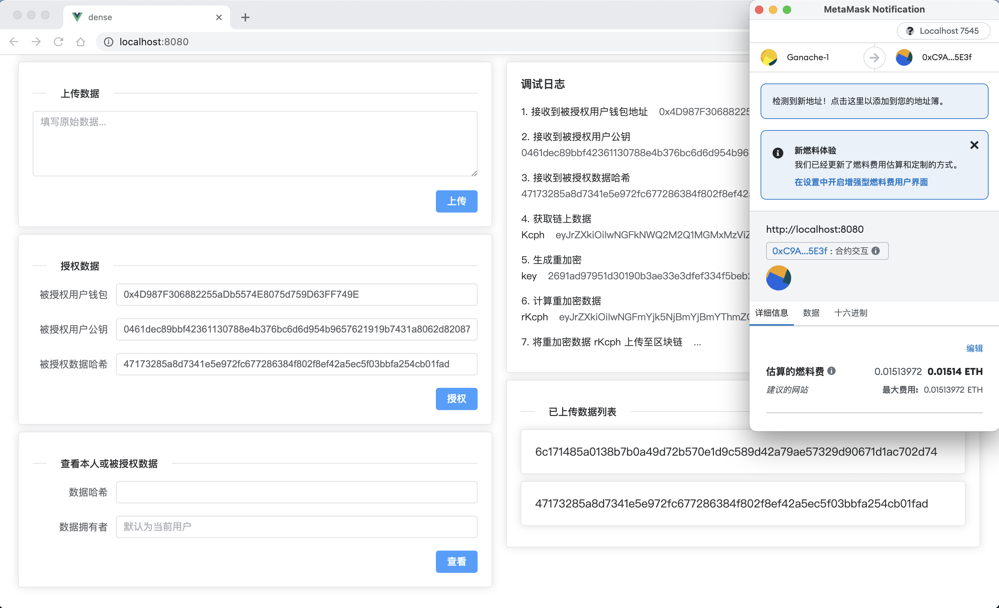

# DENSE - 数据存证共享仓库

DENSE = **D**eposit c**E**rtificate a**N**d **S**haring r**E**pository

## 快速开始

1. 启动一个 Ganache 以太坊区块链实例，使用默认端口 7545。
2. 使用 `truffle migrate` 命令部署合约。
3. 使用 `yarn serve` 命令启动项目，连接 MetaMask 到该区块链网络。
4. 打开两个浏览器实例，从 Ganache 的 Accounts 中选取不同账号导入 MetaMask 并连接。
5. 在 `./src/App.vue` 中配置合约地址、选取的账号钱包以及公私钥信息。

## 项目结构

- `./contracts`：存储合约文件。
- `./migrations`：合约部署脚本。
- `./truffle-config.js`：truffle 配置文件。
- `./src/App.vue`：业务逻辑主体代码。

## 功能介绍

### 上传数据

1. 用户上传数据明文 M；
2. 计算 M 的哈希值 hash；
3. 随机生成对称密钥 k；
4. 基于 k 对 M 进行 AES 加密得到的密文 cph；
5. 使用 RSA 公钥加密 k 和 cph 得到 Kcph；
6. 调用合约的 `uploadData` 方法将 Kcph 和 hash 一起上传至区块链。

### 授权数据

1. 填写被授权用户钱包、公钥以及数据哈希；
2. 调用合约的 `viewData` 方法获取 Kcph；
3. 使用当前用户的私钥和被授权用户的公钥对 Kcph 进行代理重加密，得到重加密数据 rKcph；
4. 调用合约的 `shareData` 方法将 rKcph 上传至区块链。

### 查看本人或被授权数据

1. 使用本人账号或被授权账号查看数据，填写数据哈希以及数据拥有者；
2. 调用合约的 `viewData` 方法获取 Kcph（如果是被授权用户获取到的则是 rKcph）；
3. 使用当前账号的 RSA 私钥对 Kcph / rKcph 进行解密，得到对称密钥 k 和密文 cph；
4. 使用 k 对 cph 进行 AES 解密得到明文 M；
5. 计算 M 的哈希值与链上数据比对，完成数据校验。

